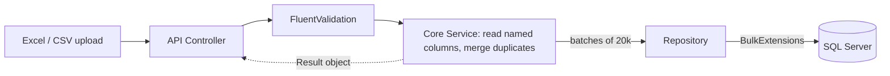

# 📊 Purchase & Sales Analytics API

A .NET 8 Web API that takes in **messy, real-world purchase and sales exports** (Excel / CSV) from a wholesale ERP and turns them into useful analytics: top-selling products, deadstock and per-product profit.

[](https://accountantapi.ahmedeltwab.com/swagger/index.html)
[](https://dotnet.microsoft.com/)
[](https://www.microsoft.com/sql-server)
[](docker-compose.yml)
[](.github/workflows/deploy.yml)

> 🔗 **Live API:** https://accountantapi.ahmedeltwab.com/swagger/index.html
> 🧪 **Sample files:** [`Examples/`](Examples). These are fake datasets you can upload right away.

---

## 📖 The Story

This project began as a **technical assessment for a job at a wholesale market chain**. I received real sales and purchase exports from their ERP system and was asked to build a system that loads them and answers business questions:

1. Upload purchase & sales data from **CSV or Excel**
2. Get the **top N** products by sales
3. Find **deadstock** (products with low sales)
4. View a **profit report** for each product
5. **Search** for a product by name

I made it to the **final phase** but wasn't selected. I kept working on the project anyway and used it to practice what I would have done with more time: refactoring toward cleaner design, adding stronger error handling and validation, and finally containerizing and deploying it with a CI/CD pipeline.

> The original company files contain real business data, so they are **not** included. The files in [`Examples/`](Examples) are generated fake data with the same key columns.

---

## 🧪 Try It in 60 Seconds

1. Open the **[live Swagger UI](https://accountantapi.ahmedeltwab.com/swagger/index.html)**.
2. Download a sample file from [`Examples/`](Examples):

   | File | Use with |
   |---|---|
   | [`mock_purchases.csv`](Examples/mock_purchases.csv) / [`.xlsx`](Examples/mock_purchases.xlsx) | `POST /api/upload/Purchase` |
   | [`mock_sales.csv`](Examples/mock_sales.csv) / [`.xlsx`](Examples/mock_sales.xlsx) | `POST /api/upload/Sale` |

3. **Upload purchases** with `POST /api/upload/Purchase`:

   | Field | Value |
   |---|---|
   | `headerRow` | `1` |
   | `productNameHeader` | `Product Name` |
   | `priceHeader` | `Total Price` |
   | `purchaseFile` | `mock_purchases.csv` |

4. **Upload sales** with `POST /api/upload/Sale`:

   | Field | Value |
   |---|---|
   | `headerRow` | `1` |
   | `productNameHeader` | `Product Name` |
   | `quantityHeader` | `Quantity` |
   | `priceHeader` | `Total Price` |
   | `salesFile` | `mock_sales.csv` |

5. **Query the analytics:** `GET /GetTopSales/5`, `GET /GetDeadstock`, `GET /GetProfit/Milk 1L`, `GET /GetProduct/Rice`

> 💡 The sample files contain extra columns (`Transaction ID`, `Date`, `Unit Price`). The API **ignores them on purpose** and reads only the columns you name. See *Challenge 1* below.

---

## 🧗 Challenges & How I Solved Them

### 1. Real ERP exports are messy
The real files had **Arabic headers**, report titles and metadata rows *above* the table, so the header was **not on row 1**. They also had many columns the analysis didn't need.

**Solution:** the user tells the API **which row holds the header** and **what the relevant columns are called** (`headerRow`, `productNameHeader`, `quantityHeader`, `priceHeader`). The parser skips to that row, checks that the named columns exist (returning a clear error if they don't), and reads **only those columns**. As a result, the same endpoint works with any branch's export format and in any language.

### 2. Performance: from minutes to ~80 seconds
The first version took **several minutes** to load a full sheet of around 1M rows. Changes that helped:
- **Batching** rows (20,000 per batch) before writing to the database
- **`EFCore.BulkExtensions`** (SqlBulkCopy) instead of EF Core's change-tracked `SaveChanges`
- An **in-memory `HashSet`** of existing product names, so the database isn't queried for every row
- **`AsNoTracking`** on read queries, plus **pagination** on deadstock

**Result:** a full ~1M-row sheet now loads in **about 80 seconds** (measured with a `Stopwatch` in the controller). There is still room to improve this. See *What's Next*.

### 3. Duplicate products
The same product can show up many times in one file and across several uploads.

**Solution:** duplicates are **merged**. When a product repeats, its values are added to the existing record (both within the current batch and against what's already in the database), so no duplicate rows are created.

### 4. Product codes didn't match
The product codes in the purchase file **didn't match** those in the sales file, and the codes also **differ between branches**. A code couldn't serve as a reliable key.

**Solution:** I changed the schema so the **product name is the primary key** and sales reference products by name. This is visible in the migration history (`changeProductID` → `ProductNamePK`).

### 5. Layered error handling
Early versions relied on exceptions for control flow.

**Solution:**
- **Result pattern** (`Result<T>` with typed `ErrorType`), so services return success or failure explicitly and [`ResultExtensions`](SRC/Purchase&Sales_API/ResultExtensions.cs) maps them to the right HTTP status
- **FluentValidation** on the upload DTOs, so bad input is rejected before any processing
- **Global error-handling middleware** as a safety net for anything unexpected

### 6. Shipping it: Docker + CI/CD
To demonstrate DevOps skills, I added:
- **Dockerfiles** for the API and the React frontend, plus `docker-compose` with SQL Server (including a health check, so the API waits for the DB)
- A **GitHub Actions** pipeline that builds, pushes the image to **Azure Container Registry** and deploys to **Azure Container Apps** on every push to `main`
- A custom domain: `accountantapi.ahmedeltwab.com`

---

## 🏗️ Architecture

The project follows Clean Architecture: each layer depends only on the layers beneath it, and the domain has no external dependencies.

```
SRC/
├── Purchase&Sales_API/             # Controllers, middleware, Result → HTTP mapping
├── Purchase&Sales_Core/            # Services (one use case per class), DTOs, validators, Result<T>
├── Purchase&Sales_Domain/          # Entities + repository interfaces
├── Purchase&Sales_Infrastructure/  # EF Core DbContext, repositories, migrations, bulk ops
└── frontend/                       # React + Vite + Tailwind client (work in progress)
```



### Database


---

## 📚 API Endpoints

### Ingestion (`multipart/form-data`)
| Method | Endpoint | Fields |
|---|---|---|
| `POST` | `/api/upload/Purchase` | `purchaseFile`, `headerRow`, `productNameHeader`, `priceHeader` |
| `POST` | `/api/upload/Sale` | `salesFile`, `headerRow`, `productNameHeader`, `quantityHeader`, `priceHeader` |

Accepts `.csv` and `.xlsx`. Any other format returns `400` with a clear message.

### Analytics
| Method | Endpoint | Description |
|---|---|---|
| `GET` | `/GetTopSales/{n}` | Top `n` products by sales |
| `GET` | `/GetDeadstock?pageNumber=1&pageSize=5` | Low-selling products, paginated (max page size 50) |
| `GET` | `/GetProfit/{productName}` | Profit report for one product |
| `GET` | `/GetProduct/{productName}` | Search products by name |

---

## 🛠️ Tech Stack

| Category | Technology |
|---|---|
| Backend | ASP.NET Core Web API (.NET 8) |
| Data | Entity Framework Core 8, SQL Server, EFCore.BulkExtensions |
| File parsing | CsvHelper (CSV), EPPlus (Excel) |
| Validation & errors | FluentValidation, Result pattern, global middleware |
| Docs | Swagger / Swashbuckle |
| Frontend | React 19, Vite, Tailwind CSS, Axios *(not deployed yet)* |
| DevOps | Docker, docker-compose, GitHub Actions, Azure Container Registry, Azure Container Apps |

---

## 📦 Run Locally

### Option 1: Docker (recommended)

```bash
git clone https://github.com/AhmedMTwab/Purchase-Sales-Analytics-API.git
cd Purchase-Sales-Analytics-API
cp .env.example .env        # set SA_PASSWORD
docker compose up --build
```

| Service | URL |
|---|---|
| API (Swagger) | http://localhost:8080/swagger |
| React app | http://localhost:3000 |

> SQL Server needs about 30 seconds to start on the first run. Migrations apply automatically.

### Option 2: Manual

**Prerequisites:** .NET 8 SDK, SQL Server, Node.js 20+

```bash
# API: set ConnectionStrings:ApplicationDb in appsettings.json first
dotnet run --project "SRC/Purchase&Sales_API"

# Frontend
cd SRC/frontend
npm install
npm run dev
```

---

## 🔭 What's Next

- [ ] **Background jobs for file processing** *(in progress)*: return immediately with a job ID and process large files in the background, avoiding HTTP timeouts on 1M-row uploads
- [ ] **Automated tests**: unit tests for the parsing and merge logic, and integration tests for the endpoints (the CI pipeline already has a test step ready)
- [ ] **Further ingestion speedups**: fewer per-row DB lookups during updates, streaming Excel reads
- [ ] **Authentication**, if the API becomes multi-tenant
- [ ] **Finish and deploy the React frontend**

---

## 👤 Author

**Ahmed Mohamed Eltwab**
[](https://linkedin.com/in/ahmed-twab)
[](https://github.com/AhmedMTwab)
